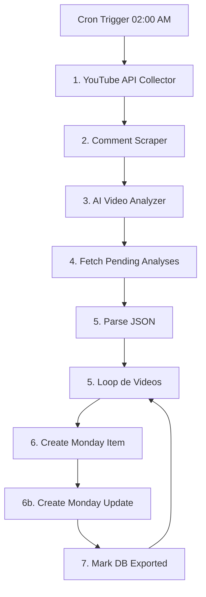

# 🏆 Trend Intelligence Engine

[](https://n8n.io)
[](https://deepmind.google/technologies/gemini/)

O **Trend Intelligence Engine** é um orquestrador híbrido sênior de inteligência competitiva e análise de sentimento semântica. Ele opera sob o conceito de **"Dark Kitchen" de Software**: todo o processamento de dados pesado, scraping e enriquecimento cognitivo via Inteligência Artificial acontecem de forma isolada em Python no *backstage*, enquanto a interface operacional é simplificada em painéis corporativos no **Monday.com**, orquestrados via **n8n v2**.

---

## 🏗️ 1. Arquitetura do Sistema ("The Dark Kitchen")

A esteira de dados opera de forma síncrona, robusta e modular, separando a inteligência da infraestrutura:



### 📡 Camadas do Pipeline
* **Ingestão (YouTube API v3):** Scripts em Python filtram criadores independentes de médio e grande porte, avaliando taxas consistentes de engajamento no YouTube em lote.
* **Corpus Semântico (Comments Extraction):** Captação automatizada e estruturada dos 100 comentários mais populares (relevantes) de cada novo vídeo encontrado.
* **Cérebro Cognitivo (Gemini 2.5 Flash + pgvector):** Ingestão do corpus dos comentários + transcrição literal das legendas do vídeo. A IA sintetiza o contraste crítico: **A Tese do Criador (Narrativa)** vs. **A Reação Real do Público (Atrito/Adesão)**, gerando embeddings de 768 dimensões persistidos no Supabase.
* **Despachante de UI (n8n GraphQL):** O n8n consome a fila do banco em lotes dinâmicos de 25 registros (paginação de segurança contra estouro de buffers de Node.js) e realiza chamadas GraphQL estritas ao Monday.com, criando os itens e anexando balões de fala HTML ricos com a análise comparativa de IA.

---

## ⚽ 2. Case de Sucesso Piloto: Copa do Mundo 2026

Para demonstrar o poder do framework de forma real, configuramos o caso de uso piloto focado nas tendências do ecossistema da **Copa do Mundo FIFA 2026**:

* **Volume Processado:** **163 vídeos de alto impacto** estruturados e vetorizados.
* **Modularidade Dinâmica:** O motor analisa os sub-temas definidos (*Figurinhas Panini*, *Análise Tática*, *Drama da Convocação*, *Polêmicas de Custos*, *Influencers*) e cria os grupos correspondentes de forma transparente e dinâmica diretamente no board do Monday.com.
* **Estabilidade Corporativa:** **0% de falhas cognitivas**, com a paginação limitando o stdout a seguros ~325KB (resolvendo o clássico gargalo `stdout maxBuffer length exceeded` de 1MB do Node.js).
* **Parâmetros do Piloto:** Todo o mapeamento de keywords e ângulos de análise está isolado e documentado em `src/pilots/world_cup_2026/config.yaml`.

---

## 🚀 3. Como Executar o Projeto Localmente

### Pré-requisitos
* Docker & Docker Compose
* Chaves de API configuradas (YouTube, Gemini, Monday.com, Supabase)

### Configuração de Variáveis de Ambiente
1. Copie o arquivo de exemplo:
   ```bash
   cp .env.example .env
   ```
2. Abra o arquivo `.env` e insira suas credenciais reais.

### Subindo os Serviços com Docker
Para inicializar o motor e o orquestrador n8n localmente, execute na pasta raiz:
```bash
docker compose -f docker/docker-compose.yml up --build -d
```
O console do n8n estará acessível em [http://localhost:5678](http://localhost:5678).

---

## 📂 4. Estrutura Canônica do Repositório

```text
├── .github/workflows/          # CI/CD no Cloud Run
├── docker/                     # Dockerfile multi-estágio e Compose
├── n8n/                        # Backup do fluxo do orquestrador
├── src/                        # Código-fonte Python
│   ├── collector.py            # Coleta na API do YouTube
│   ├── scraper.py              # Extração de comentários
│   ├── analyzer.py             # Processamento Gemini & embeddings
│   ├── fetcher.py              # Paginação síncrona do banco
│   ├── utils/
│   │   └── db.py               # Módulo relacional do Supabase
│   └── pilots/
│       └── world_cup_2026/     # Configuração e Runner do piloto
├── requirements.txt            # Dependências Python
└── README.md
```

---

## 🗺️ 5. Próximos Passos (Roadmap)
- [ ] **RAG de Insights:** Adicionar busca semântica em linguagem natural diretamente na planilha do Monday.com integrada à nossa base vetorial do Supabase.
- [ ] **Multitenancy Config:** Permitir que múltiplos boards do Monday se conectem à mesma instância do Cloud Run, chaveando via tokens nas requisições do n8n.
- [ ] **Telegram Agent Integration:** Um agente conversacional para enviar reportes de insights matinais para tomadores de decisão em tempo real.
